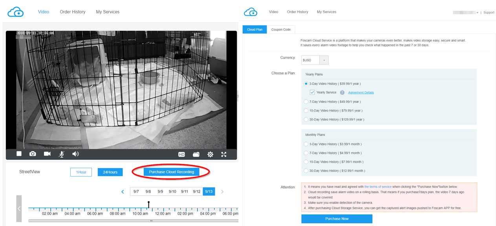
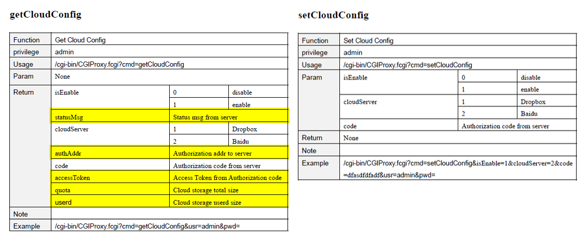
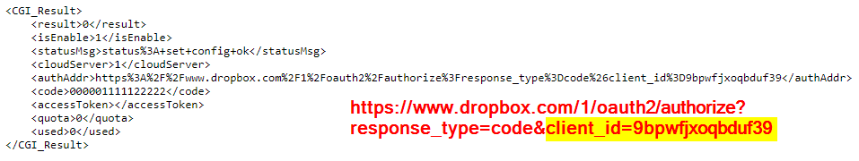
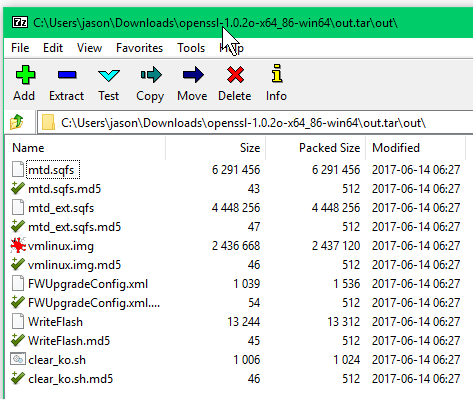
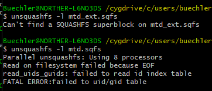

# Foscam Cloud

Foscam IP cameras offer a "Cloud Plan" for saving camera recordings to "the cloud". 
	

But some recent additions to their SDK for CGI gateway interface reveals some tantalizing info that seems like it allows us to see and potentially tinker under the hood of the cloud-recording functionality: namely that apparently Dropbox is "the cloud". (Note that the data output from the 'get' function has significantly more parts than can be 'set', at least according to the published documentation.)
	

Here's the interesting output from a run of `getCloudConfig` 
	

It seems very much like the standard dropbox API is being used (with oauth2 code), which makes my mouth water. I have my own dropbox. Maybe I don't want to pay Foscam's fees?  Logically, [according to dropbox](https://blogs.dropbox.com/developers/2013/07/using-oauth-2-0-with-the-core-api/) the client_id parameter is Foscam's API app key. I tried the most obvious next step, and attempted a `...cmd=setCloudConfig&authAddr=CUSTOM_ADDR...` but found it wasn't changed after another `getCloudConfig`.

# Breaking open fw update .bin's

That would have been so so nice. And maybe if nothing else, I could do something like rewrite all outgoing dropbox urls with that client_id to my own at the router. But for now, I'm assuming that client_id is hardcoded in the firmware files somewhere... and maybe it's as simple as changing the value and "upgrading" the firmware?  

A couple of convenient vulnerabilities indicate how to decrypt and extract Foscam firmware updates, and maybe even how to force arbitrary updates
* https://www.talosintelligence.com/reports/TALOS-2017-0379/
* https://www.talosintelligence.com/vulnerability_reports/TALOS-2017-0378

But wouldn't you know it, my old nemesis squashfs rears its ugly head. (But also a huge drop in comfort level rears its ugly head, as we're well of my usual trails.)
	

# And now I'm stuck

[I've read](http://www.devttys0.com/2014/08/mucking-about-with-squashfs/) that squashfs is often a huge boogerbrain because so many vendors customize it for their own purposes, leaving standard tools unable to work with customized output. Perhaps Sasquatch would be able to crack these nuts but I've never used it and pretty certain if I COULD find the client_id buried inside, I wouldn't know quite how to re-squash the firmware correctly, especially if anything's signed.

