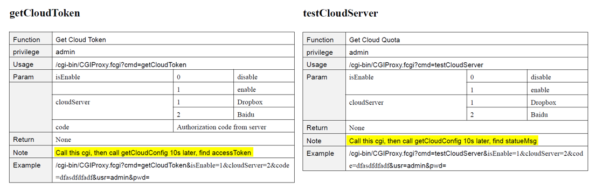

# Foscam Cloud

Foscam IP cameras offer a "Cloud Plan" for saving camera recordings to "the cloud". 

	

But some recent additions to their SDK for CGI gateway interface reveals some tantalizing info that seems like it allows us to see and potentially tinker under the hood of the cloud-recording functionality: namely that apparently Dropbox is "the cloud". (Note that the data output from the 'get' function has significantly more parts than can be 'set', at least according to the published documentation.)

	

Here's the interesting output from a run of `getCloudConfig` 

	

It seems very much like the standard dropbox API is being used (with oauth2 code), which makes my mouth water. I have my own dropbox. Maybe I don't want to pay Foscam's fees?  Logically, [according to dropbox](https://blogs.dropbox.com/developers/2013/07/using-oauth-2-0-with-the-core-api/) the client_id parameter is Foscam's API app key. I tried the most obvious next step, and attempted a `...cmd=setCloudConfig&authAddr=CUSTOM_ADDR...` but found it wasn't changed after another `getCloudConfig`.

# Overwriting embedded resources

An undocumented set-API-key function would have been so so nice. But apparently we need to look elsewhere under much heavier rocks to find a solution. Maybe if nothing else, I could do something like rewrite all outgoing dropbox urls with that client_id to my own at the router, and do some tricky https verification juggling with Burp. But it would be nice to just overwrite whatever embedded resources contain the key and be done with it...

The camera has no ssh/telnet running, but it does have a semi-secret FTP server. Unfortunately, they were smart enough to limit FTP root to /mnt/sd. It's possibly worth noting that when no SD card is present/mounted, uploading to its FTP server will write the files directly to the camera's internal storage (at /mnt/sd). 

## Option 1: Overwriting the live filesystem

Fortunately, Foscam (and the C1's specifically) has had a book's worth of vulnerabilities published (for early-ish firmware versions) allowing for a telnet service to be started, and privilege escalation to the root user! But again unfortunately, most of my cameras are completely up-to-date and although limited testing suggests downgrading to earlier firmware packages is possible, certain language in the documentation implies that mismatching versions of app-fw and sys-fw packages will lead to a bricked camera, which I am not keen on the idea of.  (Yet!  You'll see...)

Here are my findings so far using this option: [Trying to get shell access](telnet_access.md)

## Option 2: Overwriting the contents of firmware update binaries

But for now, I'm assuming that client_id is hardcoded in firmware-update files somewhere... and hoping maybe it's as simple as changing the value in the update and passing the modified update while "upgrading" the firmware?  

...aaaand I assume correctly! Mostly!

The file we want turns out to be
 * /mnt/mtd/app/bin/webService
 * and the "9bpwfjxoqbduf3" client_id string is (near) 0x7D3C6

Again, though, most of my cameras are fully updated which means the current firmware does signature verification on normal firmware update files. So I can't create the required signature on my edited resources - Sad! I can't imagine this is a hurdle that cannot be overcome (given Foscam's lackluster security background) in the future but I still need a little more trickery to proceed.

Here are my findings so far, investigating this option: [Breaking open fw update .bin's](cracking-fwupdates.md)

## Option 3: Full system recovery reflash grants master downgrade! 

Up above, I mentioned I didn't want to brick my camera... so I wanted to look a little bit more into how that might happen and/or how anyone might have recovered from such an issue in the past. And lo-and-behold I hit the motherload! 

A couple years ago, a very nice guy [put a webpage on his personal website](https://arielbarreiro.com.ar/en/recovering-bricked-foscam-c1-ip-camera) about his experiences recovering from a bricked camera. When he contacted the good people at foscam.us, they provided him a magical recovery_image.bin file and helpful instructions on how to reflash the camera with a functioning new system simply by copying the image to a certain directory on the SD-card! This is all the more interesting to those of us who've been with Foscam for a while -- if you look at older Foscam forum postings on this topic, for years Foscam seems to have denied there was any way to recover from a brick. Period. !??

(Quick aside... Also a couple years ago, the original China-based Foscam (foscam.com) had a very very public falling-out with their US-based subsidiary/supplier (foscam.us) who actually reacted by creating their own competing OEM, Amcrest.  This soured relationship might help explain why the apparent about-face.)

In any case, I tried it myself and it worked! My camera reverted back to firmware circa Aug-2015! Not to get too excited though, this recovery_image.bin file might only be usable on the C1 -- and very possibly might only be usable on early revisions of the C1?? It would be very helpful to learn more about the specifics of this file and how the process works.

Here are my findings so far, investigating this option: [Really low-level access](recovery-downgrade.md)

Actually a LOT of this third option has forked into its own life in another project, too: https://github.com/jasonbuechler/fw9900Pv3
