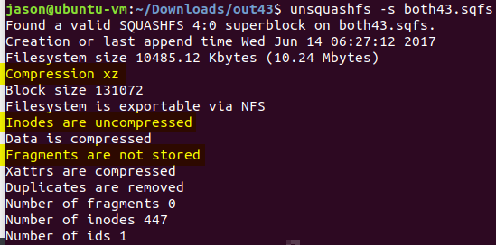

# Breaking open fw update .bin's

That would have been so so nice. And maybe if nothing else, I could do something like rewrite all outgoing dropbox urls with that client_id to my own at the router. But for now, I'm assuming that client_id is hardcoded in the firmware files somewhere... and maybe it's as simple as changing the value and "upgrading" the firmware?  

A couple of convenient vulnerabilities indicate how to decrypt and extract Foscam firmware updates, and maybe even how to force arbitrary updates
* https://www.talosintelligence.com/reports/TALOS-2017-0379/
* https://www.talosintelligence.com/vulnerability_reports/TALOS-2017-0378


`openssl enc -d -aes-128-cbc -k WWzift*v2 -md md5 -in FosIPC_E_app_ver2.x.2.43.bin -out 43bin.tgz`

(Apparently, depending on your version of openssl, the default digest type changed, so you may or may not need the `-md md5` argument.) But wouldn't you know it, my old nemesis squashfs rears its ugly head. (But also a huge drop in comfort level rears its ugly head, as we're well of my usual trails.)

	


# And now I'm stuck

[I've read](http://www.devttys0.com/2014/08/mucking-about-with-squashfs/) that squashfs is often a huge boogerbrain because so many vendors customize it for their own purposes, leaving standard tools unable to work with customized output. Perhaps Sasquatch would be able to crack these nuts but I've never used it and pretty certain if I COULD find the client_id buried inside, I wouldn't know quite how to re-squash the firmware correctly, especially if anything's signed.


# Just kidding, made it past this roadblock thanks to someone much smarter than me

The client_id is located in mtd/app/bin/webService, along with
* (9bpwfjxoqbduf39) @ 0x0007CC00
* nj9eCNlkM9G0YrF0etOZEHk3
* wur0137qwx9iryh
* CkL5ZIgcOxAwk2p3IKo0Y1gViDSXtxQB

Unfortunately, because a sqfs is compressed, you cannot (that I'm aware of) loop-mount it as rw; which means you can't just make an edit and unmount it, so we have to unsquash, then edit, then resquash. The squashed filesystem has a couple non-default options which might be important when resquashing an edited fs. Also, re-creating the tar/tgz that gets sent to open ssl requires some edits to the defaults.

`mksquashfs squashfs-root both43-MOD.sqfs -all-root -no-fragments -noI -comp xz`

`tar -cvf ../bin43-MOD.tar --owner=foscam --group=foscam -H gnu *`




# Geometry (foscam_app_2.x.2.43.bin)

Ding ding ding we have a winner
```
* sqfs filesizes
    size(both)         = 10,739,712 :: /(1024^2) = 10.242~
    size(mtd.sqfs)     =  6,291,456 :: /(1024^2) =  6
    size(mtd_ext.sqfs) =  4,448,256 :: /(1024^2) =  4.242~
* unsquashed filesizes
    size(both)         = 22,263,049 :: /(1024^2) = 21.231~~
    size(mtd)          = 13,047,530 :: /(1024^2) = 12.443~~
    size(mtd_ext)      =  9,215,519 :: /(1024^2) =  8.788~~
* geometry
    size(mtd.sqfs)/(mtd_ext.sqfs) = 1.414364~
    size(mtd.sqfs)/(both)         = 0.585812~
    size(mtd_ext.sqfs)/(both)     = 0.414187~
    sqrt(2)                       = 1.414213~
    size(mtd)/(mtd_ext)           = 1.415821~
    size(mtd)/(both)              = 0.586062~
    size(mtd_ext)/(both)          = 0.413937~
```
