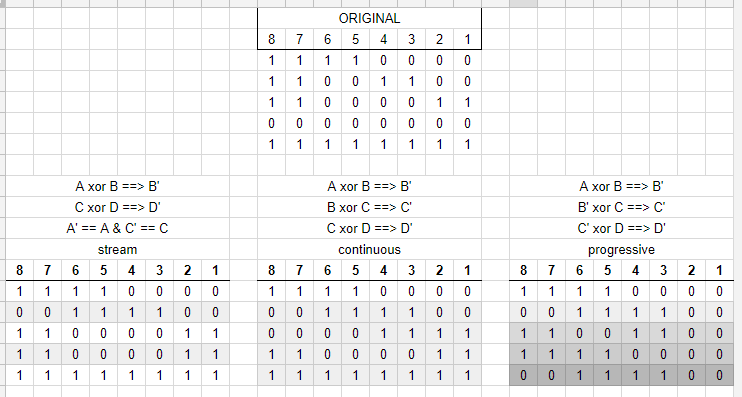

# Really low-level access

When last we met, we took a long look at those tantalizing vulnerabilities from Talos that allowed us (what turned out to be partial) access to the firmware update .bin's.  Notice we've verified a little information since then, about the recovery_image.bin and how to situate it on the SD card for loading.

Either Talos didn't have a copy of an actual oem recovery_image.bin, or they chose not to include any more details on it, besides the composition of the header required to pass integrity checks.

I tried it myself, and it worked as advertised (!) but although the instructions included with it were far more detailed than I would have guessed, they note the patch is only suitable for "C1 and FI9816P produced after March 2015" and it's likely this document was produced before the C1v2 second revision was manufactured, so it's quite possible this particular vulnerability/feature is not available with newer cameras, or that newer revision hardware wouldn't properly function after applying older firmware.

Thus it would be good to know a lot more about the file!

Talos gave a rough description of the recovery image being xor'd and included the relevant function's assembly instructions dumped from the rom....

...but no pseudocode or other details. Which was a problem because only a bit-for-bit perfect deciphering would be a valid, flashable file!

## Speedbumps

I could think of several variations on their description, and knew there might well be an infinite number more so I didn't want to just start coding a bunch of things, blindly. Here are a couple examples...

Soooo I spent many hours learning enough ARM assembly to scrape by... flipping back and forth and back and forth [to reference documentation](http://www.keil.com/support/man/docs/armasm/armasm_dom1361289873425.htm) until I was confident I knew what algorithm to apply!

I've been using Python a lot lately, so I wanted to proceed using it. But theeeen I had to learn enough python and python data structures to actually DO the thing. Previously, I've never had to directly interact with internals of binary files so this was another humbling process of unguided stumbling and learning and stumbling.

# #HumbleBrag ... first try

But holy crap it was worth it! My script de-xor'd the file successfully on the very first run! In went recover_image.bin, and out came recover_image.xor.  I could have gone and checked the header bytes to see that they reflected the checks that Talos enumerated, but after working with the firmware update .bin's, I had a suspicion that I could jump straight to 7zip...

Suspicions confirmed! 
Talos didn't know or didn't mention that the deciphered image was a header-buggered squashfs archive!
(Note: if you actually give the file an .sqfs suffix, 7zip will fail to read it. Remember me mentioning "squashfs is often a huge boogerbrain because so many vendors customize it for their own purposes"?)

So yup, it looks like the recover image is a complete filesystem, squashed, with some manipulations in the header.
